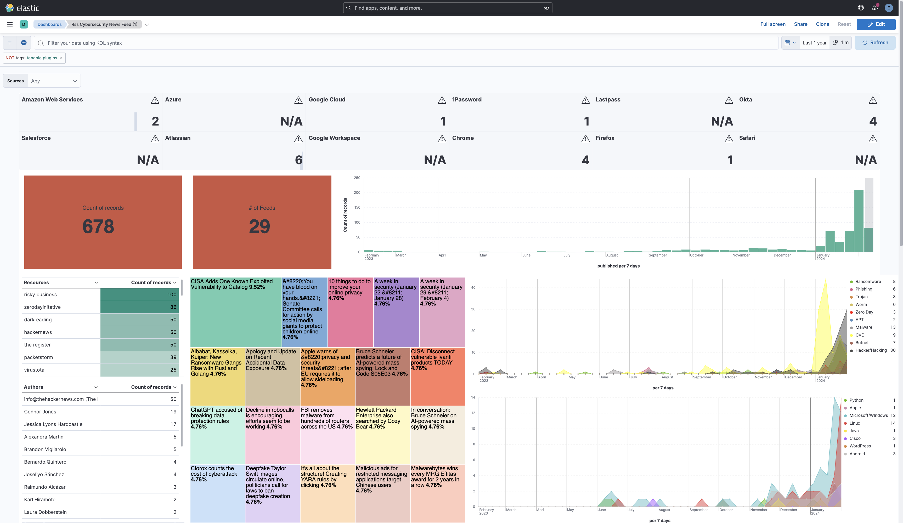
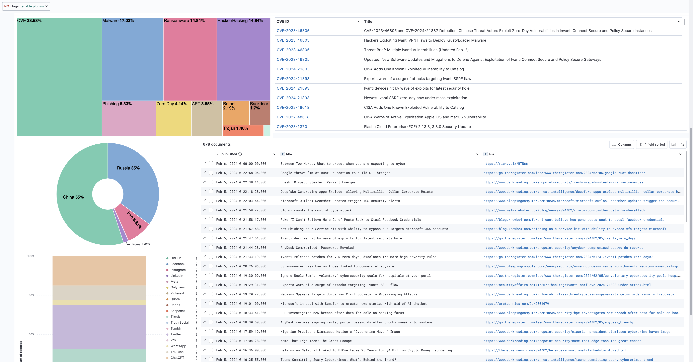

# A Quick RSS Cybersecurity News Feed

## **Software**
- Elasticsearch (v.8.12.0)
- Logstash (v.8.12.0)
- Kibana (v.8.12.0)
- Python (v.3.8.10) - Just Chill, More to Come Soon. **[Notes](./python/README.md)**
- Python Elasticsearch Client (v.8.12.0) - Just Chill, More to Come Soon. **[Notes](./python/README.md)**

## **RSS Feeds**
- Ars Technica
- Bleeping Computer
- Cybersecurity News
- Cyberscoop
- Dark Reading
- Elastic Security
- HackRead
- KnowBe4
- Krebs on Security
- Malwarebytes
- Microsoft Security
- Naked Security
- Packet Storm
- Cisco Talos
- Risky Business
- Security Affairs
- SOC Prime
- Sophos
- The DFIR Report
- The Hacker News
- The Register
- Threatpost
- Troy Hunt
- Unit42
- US-CERT
- VirusTotal
- Zero Day Initative


## **Quick Instructions**

- Add **[Component Templates](./templates/component/rss-component_template.json)** and **[Index Templates](./templates/index/rss-index_template.json)** to your Elastic Stack 
- The Logstash RSS input plugin needs to be installed. For plugins not bundled by default, it is easy to install by running `bin/logstash-plugin install logstash-input-rss`
- Create the Logstash **[rss-security-feed.conf](./logstash/rss/rss-security-feed.conf)** file and then start Logstash
    - Modify the **[pipelines.yml](./logstash/pipelines.yml)** file (optional). You can also run Logstash via the command line. 
      Reference [documentation](https://www.elastic.co/guide/en/logstash/current/getting-started-with-logstash.html) for additional details.
    - If you decide to run Logstash as a Service (systemd), then I highly recommend using the [pipelines.yml](./logstash/pipelines.yml) file and check out the directory structure [here](./logstash/conf.d/).
- Validate data is incoming and mapping is correct
    - Check data in **Discover**
    - Run `GET indexname/_mappings` in **Dev Tools**. Your mapping should match the contents in the **[rss-feed-mappings.json](./templates/mapping-output/rss-feed-mappings.json)** file.
- Import Kibana **Saved Objects**
    - Import the **[dashboard-no-enrichments.ndjson](./kibana/saved_objects/2024/dashboard-no-enrichments.ndjson)** file to import the **Saved Objects** displayed in the image below


## **Dashboard - Without Enrichment Indices**





### **Quick Notes**
- Fingerprint filter in Logstash is used to avoid document duplication
- Have fun!
- [Known Issues](./notes/known_issues.md)

---

## **Less-Quick Instructions** (Don't even look yet..)

### **Setup Directories**

**output from the elasticsearch-cve-collection.py and elasticsearch-nvd-css-collection.py scripts**
```
mkdir /etc/logstash/cvss
```
**output the known_exploited_vulnerabilities.csv** (wget -O /etc/logstash/cvss/known-vuln/known_exploited_vulnerabilities.csv https://www.cisa.gov/sites/default/files/csv/known_exploited_vulnerabilities.csv)
```
mkdir /etc/logstash/cvss/known-vuln
```
**elasticsearch-cve-collection.py and elasticsearch-nvd-css-collection.py scripts**
```
mkdir /etc/logstash/python
```
**logstash configuration files for the "cvss-rss-feed" index**
```
mkdir /etc/logstash/conf.d/cvss-scoring
```
**logstash configuration files for the "known-vulnerabilities" index**
```
mkdir /etc/logstash/conf.d/known-exploited-vuln
```
**logstash configuration files for the "rss-feed" index**
```
mkdir /etc/logstash/conf.d/news
```


