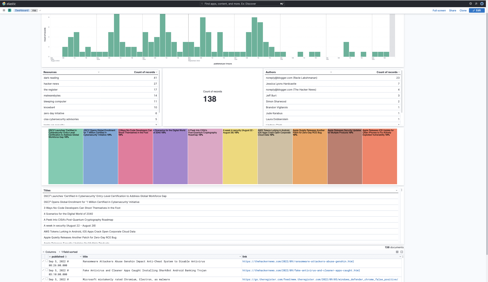
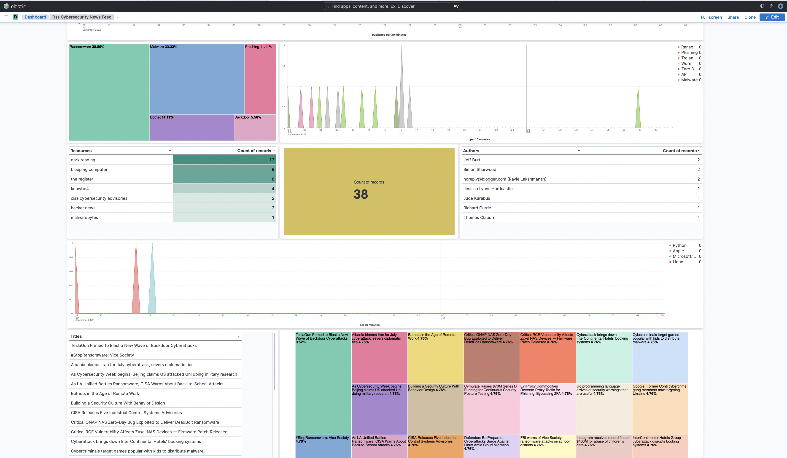

## A Quick RSS Cybersecurity News Feed
---

### **Software**
- Elasticsearch (v.8.4.1)
- Logstash 
- Kibana

### **RSS Feeds**
- Dark Reading
- Zero Day Initative
- Bleeping Computer
- The Hacker News
- The Register
- Krebs on Security
- US-CERT
- Cisco Talos
- KnowBe4
- Threatpost
- Malwarebytes
- Troy Hunt
- Microsoft Security

### **Quick Instructions**
- Add **[Component Templates](./templates/rss-component_template.json)** and **[Index Templates](./templates/rss-index_template.json)** to your Elastic Stack 
- The Logstash RSS input plugin needs to be installed. For plugins not bundled by default, it is easy to install by running `bin/logstash-plugin install logstash-input-rss`
- Create the Logstash **[rss-security-feed.conf](./logstash/rss-security-feed.conf)** file and then start Logstash
    - Modify the **[pipelines.yml](./logstash/pipelines.yml)** file (optional). You can also run Logstash via the command line. Reference [documentation](https://www.elastic.co/guide/en/logstash/current/getting-started-with-logstash.html) for additional details.
- Validate data is incoming and mapping is correct
    - Check data in **Discover**
    - Run `GET indexname/_mappings` in **Dev Tools**. Your mapping should match the contents in the **[rss-feed-mappings.json](./templates/rss-feed-mappings.json)** file.
- Import Kibana **Saved Objects**
    - Import the **[dashboard-simple.ndjson](./kibana/dashboard-simple.ndjson)** file to import the **Saved Objects** displayed in the image below
    - Note: **[dashboard-detailed.ndjson](./kibana/dashboard-simple.ndjson)** is still in progress, but feel free to test it out if you want!

#### **Simple Dashboard**

#### **Detailed Dashboard**

### **Quick Notes**
- Fingerprint filter in Logstash is used to avoid document duplication
- Have fun!
- [Known Issues](./notes/known_issues.md)